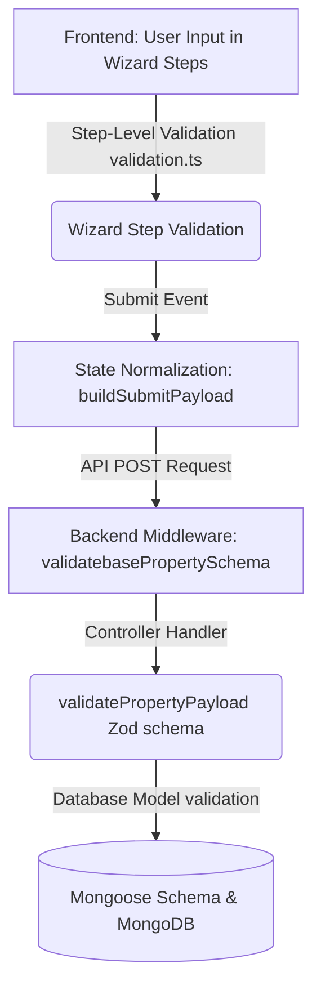

# Nagpur Prime Property - Validation Specification & Audit Report

This document presents a comprehensive audit of the property creation field validations across the backend (Express Zod schemas + Mongoose models) and the frontend (React Native Expo client wizard). It highlights exact validations, structural alignments, and critical blocker bugs/discrepancies discovered during the pair programming review.

---

## 1. Validation Pipeline Overview



The property creation validation occurs at three main stages:
1. **Frontend Step-level Validation** (`frontend/lib/validation.ts`): Active validation checking fields as the user advances through the 11-step creation wizard.
2. **Frontend Payload Normalization** (`frontend/store/addPropertyStore.ts`): Formats, maps, and coerces internal wizard keys (e.g., camelCase to PascalCase, string inputs to numbers) before sending the request.
3. **Backend Schema & Model Validation** (`backend/src/modules/property/property.schema.js` and `property.model.js`): Double-checks basic metadata using Zod schema validation middleware, runs custom conditional Zod validation for property-specific schemas, and saves to MongoDB using Mongoose schema-level constraints.

---

## 2. Core Metadata Validation Comparison (Base Schemas)

The table below details validation constraints for core metadata fields shared by all property types:

| Field Key | Backend Zod Validation | Mongoose Model Limits | Frontend Wizard Validation | Match Status | Notes / Discrepancies |
| :--- | :--- | :--- | :--- | :--- | :--- |
| `title` | `z.string().min(1).max(100)` | `maxlength: 100` | `z.string().min(5).max(100)` | **Stricter Frontend** | Frontend requires at least **5 characters**, whereas backend allows **1 character**. |
| `description` | `z.string().min(10).max(2000)` | `minlength: 10, maxlength: 2000` | `z.string().min(10)` | **Potential Risk** | Frontend does not enforce the **2000 character maximum limit** in its validation schema. |
| `listingCategory` | `z.enum(['Resale', 'Rental', 'New'])` | `enum: ['Resale', 'Rental', 'New']` | Internal: `resale`, `rental`, `new` | **Aligned** | Frontend payload builder maps lowercase values to capitalized backend enums. |
| `propertyType` | `z.enum([...])` (10 options) | `enum: PROPERTY_TYPES` | Internal: `flat`, `villa`, etc. | **Aligned** | Frontend payload builder maps abbreviated keys to backend labels (e.g., `res_plot` → `Residential Plot`). |
| `propertyListedBy`| `z.enum(['Owner', 'Broker', 'Builder'])` | `enum: PROPERTY_LISTED_BY_OPTIONS`| Required check in `validateState` | **Aligned** | Aligned on options. |
| `location.locality`| `z.string().min(2).max(100)` | `minlength: 2, maxlength: 100` | `z.string().min(1)` | **Stricter Backend** | Frontend accepts a 1-character locality, which will fail backend validation (needs min 2 chars). |
| `location.pinCode` | `z.string().regex(/^44\d{4}$/)` | `match: /^44\d{4}$/` (Nagpur) | No Zod validation on frontend | **Gap / Risk** | Frontend does not validate Nagpur zip code regex; an invalid input will result in a raw API error. |
| `location.coordinates`| `[longitude, latitude]` (Length 2) | `2dsphere` index | Required `latitude` and `longitude` | **Aligned** | Frontend payload builder correctly packages coordinates into a GeoJSON `Point`. |
| `photos` | `z.array(z.string().url()).min(1).max(15)`| `minlength: 1, maxlength: 15` | `z.array(z.string()).min(1)` | **Aligned** | Frontend store limits additions to 15 in state. Backend checks URL structure. |
| `video` | `z.string().url().nullable().optional()`| Optional | Optional string | **Aligned** | Matches. |
| `amenities` | `z.array(z.string()).optional()` | Array of strings | Multi-select checkboxes | **Aligned** | Matches predefined list. |

---

## 3. Detailed Specifications Validation (Step 3)

The wizard step details are conditionally validated based on the property type.

### Residential (Flat/Apartment, Builder Floor, Penthouse)
*   **BHK**: Backend enforces integer `[0 - 8]`; Frontend matches `[0 - 8]`.
*   **Bathrooms**: Backend enforces integer `[0 - 15]`; Frontend matches `[0 - 15]`.
*   **Balconies**: Backend enforces integer `[0 - 10]`; Frontend uses the same range (optional).
*   **Floor & Total Floors**: Backend enforces `floorNumber [0 - 99]` and `totalFloors [1 - 99]`. Frontend validates these ranges and **extra-checks** that `floorNumber` does not exceed `totalFloors`.
*   **Area**: `carpetArea` is required positive number on both.
*   **Furnishing**: Enum of 5 options (`Unfurnished`, `Semi-Furnished`, `Fully Furnished`, `Bare Shell`, `Warm Shell`) matches exactly on both.

### Villa / Independent House
*   **BHK & Bathrooms**: Integer validation matches exactly (`BHK [0-8]`, `Bathrooms [0-15]`).
*   **Floors**: `numberOfFloors` (string) is required on both.
*   **Areas**: Both `plotArea` and `builtUpArea` are required positive numbers on both.
*   **Parking**: `parkingSlots` integer `[0 - 10]` required on both.

### Commercial Office Space
*   **Carpet Area**: Required positive number on both.
*   **Floor Numbers**: matches Flat rules (floorNumber required, totalFloors optional).
*   **Washrooms**: Backend Zod/Mongoose enforces integer `[1 - 10]`. Frontend validation matches `[1 - 10]`, but the **frontend field matrix** uses `min: 0, max: 20` for its UI slider, creating a minor range mismatch.

---

## 4. Critical Blocker Bugs & Schema Mismatches

During the audit, we uncovered **5 critical mismatches** that will cause property creation to either fail on the client side or be rejected/corrupted on the backend:

### 🚨 Blocker 1: Residential Plot Area Key Casing Mismatch (`plotAreaSqFt` vs `plotAreaSqft`)
*   **Backend expectation**: `plotAreaSqFt` (with capital `F` in `Ft`).
*   **Frontend field matrix**: defines key as `plotAreaSqft` (with lowercase `f` in `ft`).
*   **Frontend validation logic** (`validateStepDetailsA`):
    ```typescript
    const areaKey = propertyType === 'agri_land' ? 'areaAcres' : 'plotAreaSqFt'; // checks capital F
    ```
*   **Impact**: When the user enters the plot area, it saves to `plotAreaSqft` (lowercase). Frontend validation checks `plotAreaSqFt` (uppercase), finds it empty, and blocks submission with `"Plot Area (sq.ft) is required"`. Even if bypassed, the backend would reject it because `plotAreaSqFt` is required but sent as `plotAreaSqft`.

### 🚨 Blocker 2: Residential Plot Length & Width Silent Data Loss
*   **Backend expectation**: `plotLength` and `plotWidth` (positive numbers).
*   **Frontend field matrix**: defines keys as `length` and `width`.
*   **Frontend payload builder**: does not map `length` and `width` to `plotLength` and `plotWidth`.
*   **Impact**: Plot dimensions are submitted as `length` and `width`. The backend Zod schema ignores them (strips them out) because they are unrecognized keys, while `plotLength` and `plotWidth` remain empty in the database, causing silent data loss.

### 🚨 Blocker 3: Shop Furnishing Mandatory Blocker
*   **Backend expectation**: `shopBase` details schema does **not** include a `furnishing` field.
*   **Frontend field matrix**: `shop` details does **not** render a furnishing selector in the UI.
*   **Frontend validation logic** (`validateStepDetailsB`):
    ```typescript
    const showFurnishing = isResidential || isOffice || propertyType === 'shop';
    if (showFurnishing && !step3Data.furnishing) {
      errors.furnishing = 'Furnishing status selection is required';
    }
    ```
*   **Impact**: Because `'shop'` is included in `showFurnishing`, but the field is not rendered in the form, `step3Data.furnishing` is always empty. Frontend validation fails, blocking the user from submitting any Shop listing.

### 🚨 Blocker 4: Warehouse Floor Load Capacity Type Mismatch
*   **Backend expectation**: `floorLoadCapacity` is a string with max length 50:
    ```javascript
    floorLoadCapacity: optionalString(FLOOR_LOAD_CAPACITY_MAX_LENGTH, ...)
    ```
*   **Frontend payload builder** (`addPropertyStore.ts`):
    ```typescript
    const numFields = [ ..., "floorLoadCapacity", ... ]; // coerces it into a number
    ```
*   **Impact**: If the user types a value like `"500 kg/sq.ft"`, the frontend converts it to a number (or `NaN` if non-numeric). Sending a number to the backend will trigger a Zod schema validation error: `Expected string, received number`.

### 🚨 Blocker 5: Agricultural Land Option Mismatches
*   **Water Source Options**:
    *   **Backend enum**: `['Well', 'Borewell', 'Canal', 'River', 'None']`
    *   **Frontend matrix**: `['Borewell', 'Canal', 'River', 'Rain-fed', 'Well']` (contains `Rain-fed`).
    *   *Impact*: If a user selects `Rain-fed` on the frontend, the backend API will reject the request due to enum validation failure.
*   **Road Type / Access**:
    *   **Backend enum**: `['Tar Road', 'Concrete', 'Mud', 'Kachcha']`
    *   **Frontend matrix**: `roadType` is defined as a text field, but **not rendered** in the UI wizard. Instead, `roadAccess` is rendered as a boolean toggle.

---

## 5. Pricing Details Validation (Step 4)

Pricing validations differ based on the category of listing:

| Listing Category | Required Fields | Backend Zod Validation | Frontend Validation | Match Status | Notes / Discrepancies |
| :--- | :--- | :--- | :--- | :--- | :--- |
| **Resale** | `totalPrice`, `possessionTimeline` | Positive number, enum | Positive number, required check | **Aligned** | Mapped correctly in payload builder. |
| **Rental** (Agri) | `annualLease`, `securityDeposit` | Positive numbers | Positive numbers | **Aligned** | Monthly rent is omitted for agri land. |
| **Rental** (Other) | `monthlyRent`, `securityDeposit`, `availableFrom` | Positive numbers, Date | Positive numbers, Date | **Stricter Frontend** | Backend defines `availableFrom` as optional; Frontend wizard treats it as required. |
| **New Launch** | `startingPrice`, `possessionDate` | Positive number, YYYY-MM-DD regex | Positive number, YYYY-MM-DD regex | **Aligned** | Aligned. |

---

## 6. Recommended Action Plan to Resolve Mismatches

To resolve the validation blockers and align the frontend and backend validation seamlessly, we recommend the following quick edits:

### A. Fix Residential Plot Area Key Case & Dimension Keys
1. In `frontend/lib/fieldMatrix.ts`, update the key for plot area, length, and width:
   ```diff
   - { key: 'plotAreaSqft', label: 'Plot Area (sq.ft)',  type: 'number', required: true  },
   + { key: 'plotAreaSqFt', label: 'Plot Area (sq.ft)',  type: 'number', required: true  },
   - { key: 'length',       label: 'Length (ft)',         type: 'number', required: false },
   + { key: 'plotLength',   label: 'Length (ft)',         type: 'number', required: false },
   - { key: 'width',        label: 'Width (ft)',          type: 'number', required: false },
   + { key: 'plotWidth',    label: 'Width (ft)',          type: 'number', required: false },
   ```
2. In `frontend/components/addProperty/wizard/WizardDetailsBScreen.tsx`, update the conditional checks for rendering plot-specific fields:
   ```diff
   - {type === 'res_plot' && (
   + {type === 'res_plot' && (
   ```

### B. Fix Shop Furnishing Mandatory Validation Blocker
In `frontend/lib/validation.ts`, remove `shop` from the `showFurnishing` calculation:
```diff
- const showFurnishing = isResidential || isOffice || propertyType === 'shop';
+ const showFurnishing = isResidential || isOffice;
```

### C. Fix Warehouse Floor Load Capacity Type Mismatch
In `frontend/store/addPropertyStore.ts`, remove `"floorLoadCapacity"` from `numFields` to prevent it from being coerced to a number:
```diff
    const numFields = [
      "bhk", "bathrooms", "balconies", "floorNumber", "totalFloors",
      "carpetArea", "builtUpArea", "superBuiltUpArea", "plotArea", "parkingSlots",
-     "roadWidth", "terraceArea", "totalUnitsInBuilding", "cabinCount", "openDesks",
+     "roadWidth", "terraceArea", "totalUnitsInBuilding", "cabinCount", "openDesks",
-     "washrooms", "frontage", "depth", "ceilingHeight", "showroomArea",
+     "washrooms", "frontage", "depth", "ceilingHeight", "showroomArea",
-     "numberOfShowroomFloors", "warehouseArea", "warehouseHeight", "numberOfDocks",
+     "numberOfShowroomFloors", "warehouseArea", "warehouseHeight", "numberOfDocks",
-     "openYardArea", "powerLoad", "plotAreaSqFt", "plotLength",
+     "openYardArea", "powerLoad", "plotAreaSqFt", "plotLength",
-     "plotWidth", "fsiAvailable", "areaAcres", "areaHectares", "distanceFromCity",
+     "plotWidth", "fsiAvailable", "areaAcres", "areaHectares", "distanceFromCity",
-     "totalUnitsInProject", "unitsAvailable", "totalVillasInProject",
+     "totalUnitsInProject", "unitsAvailable", "totalVillasInProject",
-     "totalPlotsInLayout", "plotsAvailable", "floorLoadCapacity"
+     "totalPlotsInLayout", "plotsAvailable"
    ];
```

### D. Fix Agricultural Land Option Mismatches
1. In `frontend/lib/fieldMatrix.ts` under `agri_land` options, replace `Rain-fed` with `None`:
   ```diff
   - options: ['Borewell', 'Canal', 'River', 'Rain-fed', 'Well']
   + options: ['Borewell', 'Canal', 'River', 'None', 'Well']
   ```
2. Render `roadType` in `WizardDetailsBScreen.tsx` using exact options matching the backend enum (`Tar Road`, `Concrete', 'Mud', 'Kachcha') instead of free-text.

---

*End of Document. Audit completed on June 10, 2026.*
